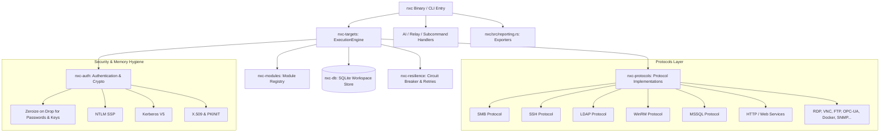

# NetExec-RS (`nxc-rs`) Architecture & Component Guide

## Architectural Overview

NetExec-RS is a high-performance network orchestration and security assessment tool written in pure Rust. It provides a modular, memory-safe, concurrent engine capable of interacting with enterprise protocols (SMB, SSH, LDAP, WinRM, MSSQL, RDP, etc.).

---

## Workspace Crates

| Crate | Responsibility |
|---|---|
| [`nxc`](file:///C:/Users/frimp/Documents/nxc-rs/nxc-rs/nxc) | Application entry point, CLI arguments parsing, signal handling, exports, and relay server. |
| [`nxc-auth`](file:///C:/Users/frimp/Documents/nxc-rs/nxc-rs/auth) | NTLM SSP, Kerberos v5, PKINIT, certificate parsing, SAM/LSA registry parsing, memory zeroization. |
| [`nxc-protocols`](file:///C:/Users/frimp/Documents/nxc-rs/nxc-rs/protocols) | Implementations of `NxcProtocol` and `NxcSession` across network services. |
| [`nxc-modules`](file:///C:/Users/frimp/Documents/nxc-rs/nxc-rs/modules) | Extensible post-enumeration modules (BloodHound, gMSA, SAM dump, etc.). |
| [`nxc-targets`](file:///C:/Users/frimp/Documents/nxc-rs/nxc-rs/targets) | Target parsing (IP, CIDR, ranges, files), bounded asynchronous concurrency (`ExecutionEngine`). |
| [`nxc-db`](file:///C:/Users/frimp/Documents/nxc-rs/nxc-rs/db) | Workspace-aware SQLite storage for discovered hosts, credentials, shares, and loot. |
| [`nxc-resilience`](file:///C:/Users/frimp/Documents/nxc-rs/nxc-rs/resilience) | Circuit breakers, exponential backoff, per-target rate limiting, and failure tracking. |
| [`nxc-ai`](file:///C:/Users/frimp/Documents/nxc-rs/nxc-rs/ai) | LLM assistant integration for command synthesis and natural-language analysis. |
| [`nxc-sessions`](file:///C:/Users/frimp/Documents/nxc-rs/nxc-rs/nxc-sessions) | Session state serialization and management. |
| [`nxc-tests`](file:///C:/Users/frimp/Documents/nxc-rs/nxc-rs/nxc-tests) | End-to-end integration test suites. |

---

## Security Model & Protections

### 1. Memory Safety & Sensitive Data Protection
- Credentials and cryptographic secrets implement `zeroize::Zeroize` and `#[zeroize(drop)]` across `nxc-auth` and `nxc-db`.
- Plaintext passwords and cryptographic hashes are never displayed via `Display` or dumped into public loggers.

### 2. TLS Verification
- SSL/TLS certificate verification is enabled by default across all secure endpoints (HTTPS, WinRM over SSL, LDAPS).
- Insecure connections must be explicitly authorized using `--insecure`.

### 3. File & Report Export Sanitization
- All file exports (JSON, CSV, HTML, XML, Markdown, PDF, NDJSON) write to temporary files first before atomic rename.
- CSV exports automatically escape formula injection prefixes (`=`, `+`, `-`, `@`, `\t`, `\r`).
- Path inputs are sanitized to eliminate directory traversal risks.

### 4. Ethical Guardrails & Safe Mode
- `--safe-mode` / `--enum-only` restricts execution to read-only discovery, preventing accidental password lockouts or destructive writes.
- Global and per-user/per-host failure thresholds (`--gfail-limit`, `--ufail-limit`, `--fail-limit`) prevent active directory account lockouts.
